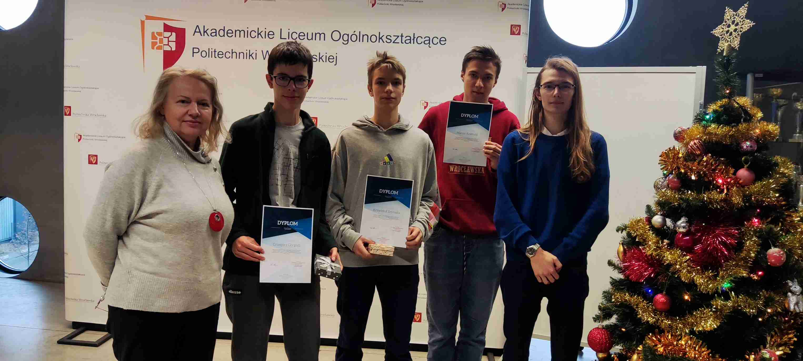
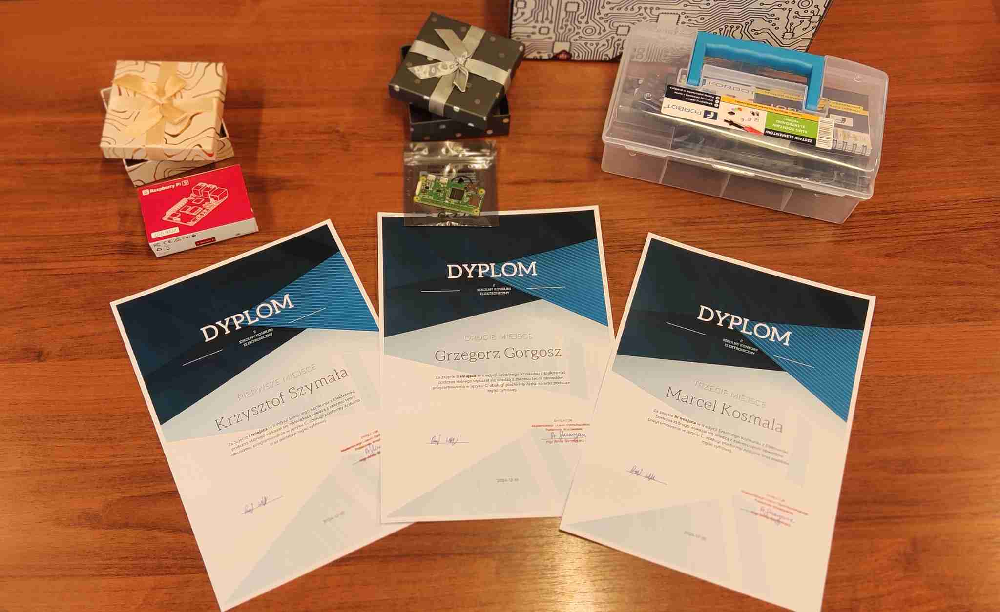

+++
date = '2024-12-03T10:00:00+01:00'

title = '3.8 II Konkurs z elektroniki'
+++

## II Konkurs z elektroniki - 2024

Zakres zagadnień obejmuje tematy poruszone na zajęciach dodatkowych:
podstawy teorii obwodów, arduino, język C oraz podstawy logiki
cyfrowej. Konkurs odbędzie się w dniu 03.12.2024 godz. 15.15-16.00 w
sali 3.06. Do wygrania minikomputer Raspberry PI 5 4GB oraz zestawy komponentów
elektronicznych.

### Arkusz i rozwiązania

| Typ Dokumentu | Odnośnik                                           |
| ------------- | -------------------------------------------------- |
| Arkusz        | [Konkurs 2024](./konkurs_arkusz_2024.pdf)          |
| Rozwiązania   | [Rozwiązania 2024](./konkurs_rozwiazania_2024.pdf) |

### Galeria

Oficjalny post na stronie [ALO PWr](https://www.facebook.com/liceumPWr/posts/988262823111065). Gratuluję wszystkim uczestnikom i zwycięzcom!

Galeria zdjęć z konkursu:

