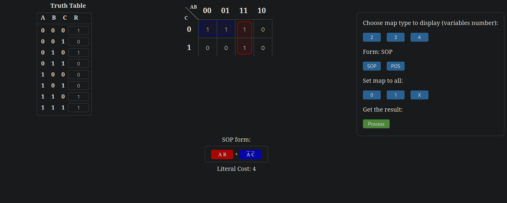

+++
date = '2025-01-31T10:00:00+01:00'

title = '3.10 Układy logiczne - kontynuacja'
+++

## Układy logiczne

- [Układy logiczne](#układy-logiczne)
  - [Optymalizacja funkcji logicznej](#optymalizacja-funkcji-logicznej)
  - [Kod Grey'a](#kod-greya)
  - [Metoda Karnaugh](#metoda-karnaugh)
  - [Metoda Karnaugh Online](#metoda-karnaugh-online)
  - [Układy Kombinacyjne](#układy-kombinacyjne)
  - [Układy Sekwencyjne](#układy-sekwencyjne)


Jako przypomnienie zachęcam spojrzeć na podane zagadnienia:
- [Tabele Prawdy](https://sites.millersville.edu/bikenaga/math-proof/truth-tables/truth-tables.html) - jak zapisać funkcję logiczną? Możemy to zrobić przyporządkowując wszystkim możliwym wartościom na wejściu określony wynik.
- Bramki Logiczne - przypomnijmy sobie bramki NOT, AND, OR. [Ten film](https://www.youtube.com/watch?v=INEtYZqtjTo) w bardzo prosty sposób to wyjaśnia, w prawym dolnym rogu umieszczając odpowiednie tabele prawdy.
- Kompletność NOR/NAND - okazuje się, że negacja alternatywy pozwala nam skonstruować dowolny układ logiczny. Zobaczcie sekcje Examples w artykule [Functional completeness](https://en.wikipedia.org/wiki/Functional_completeness#Examples), żeby przekonać się jak za pomocą NOR wyrazić AND, OR, NOT. Jest to bardzo pożądana cecha, ponieważ dzięki niej możemy wykorzystywać tylko jeden typ fizycznego układu scalonego do realizacji dowolnego układu logicznego.

Rozważmy teraz kilka metod optymializacji układów logicznych.


### Optymalizacja funkcji logicznej


> Dlaczego? Chcemy zrealizować układ logiczny za pomocą najmniejszej liczby fizycznych komponentów.

Rozwińmy zadanie 10 z [tegorocznego konkursu](./../08-konkurs/konkurs_arkusz_2024.pdf) - istnieje heurystyczna (nieidealna, ale wystarczająca) metoda na upraszczanie tego typu funkcji, z którą w dalszej części będziemy się zapoznawać.

### Kod Grey'a

W celu zrozumienia metody Karnaugh warto wpierw zaznajomić się z [Kodem Gray'a](https://en.wikipedia.org/wiki/Gray_code). Jest to ciąg zer i jedynek, w którym sąsiadujące liczby różnią się jednym bitem. Można go łatwo wygenerować na kartce, za pomocą poniższej metody:

1. Rozpoczynamy od najmniejszego ciągu, czyli `0` oraz `1`. Zapiszmy je pionowo, pod sobą:
 
    ```
    0
    1
    ```

1. Odbijamy powyższą sekwencję w dół i dopisujemy `0` przed oryginalnymi wartościami oraz `1` przed odbiciem.<br/> Uzyskaliśmy $2$-bitowy kod Gray'a (4 rzędy):

    ```
    00
    01
    --
    11
    10
    ```

Liczba $2$ (liczymy od zera) w kodzie Gray'a jest zapisana jako $2 = 11_{g}$.

3. Powtarzamy proces: odbijamy dotychczasową tablicę i dopisujemy `0` przed oryginalnymi wartościami oraz `1` przed odbiciem. Uzyskaliśmy $3$-bitowy kod Gray'a (8 rzędów):

    ```
    000
    001
    011
    010
    ---
    110
    111
    101
    100
    ```

4. Ponownie odbijamy i dodajemy `0` oraz `1`. Uzyskaliśmy $4$-bitowy kod Gray'a (16 rzędów):
  
    ```
    0000
    0001
    0011
    0010
    0110
    0111
    0101
    0100
    ----
    1100
    1101
    1111
    1110
    1010
    1011
    1001
    1000
    ```

Liczbę $15$ (liczymy od zera) w kodzie Gray'a zapisujemy jako $15 = 1000_{g}$.

Tę metodę można kontynuować, aby generować kod Gray'a dla większej liczby bitów.

### Metoda Karnaugh

Wytłumaczenie metody Karnaugh nie należy do najprostszych zadań, ale szczęśliwie powstał film [Karnaugh Maps - Introduction](https://www.youtube.com/watch?v=3vkMgTmieZI). Jest to dobre wprowadzenie do tematu, które warto obejrzeć. Metoda Karnaugh jest pokazywana na większości kierunków informatycznych.

### Metoda Karnaugh Online

Zobaczmy jedną ze stron [Karnaugh Map Solver](https://wredan.github.io/Karnaugh-Map-Solver/), która pozwala na wpisanie funkcji logicznej i automatyczne wygenerowanie uproszczonej postaci. Wybieram 3 zmienne, oraz podaję definicję funkcji z zadania 10, aby następnie zobaczyć uproszczone wyrażenie.



Rzędy oraz kolumny tabeli odpowiadają kolejnym wartością z kodu Grey'a. Wartości funkcji logicznej są zapisane w komórkach tabeli. Wartość `1` w drugiej kolumnie, pierwszym rzędzie oznacza, że dla wartości $A=0, B=1, C=0$ funkcja przyjmuje wartość `1`, co zgadza się z wprowadzoną tablicą prawdy (po lewej stronie). Na dole widzimy uproszczoną postać funkcji logicznej, która jest równoważna z wpisaną tabelą prawdy. Literal cost jest równy 4, co oznacza, że do realizacji układu logicznego potrzebujemy 4 bramek logicznych.

### Układy Kombinacyjne

Układy kombinacyjne to takie układy, których wyjście zależy od aktualnego stanu wejść. Podczas poprzednich zajęć omówiliśmy kilka z nich:
- [Półsumator](https://www.tutorialspoint.com/digital-electronics/digital-electronics-half-adder.htm) (Half Adder)
- [Pełny Sumator](https://www.tutorialspoint.com/digital-electronics/digital-electronics-full-adder.htm) (Full Adder)
- [Komparator](https://www.tutorialspoint.com/digital-electronics/digital-electronics-comparators.htm) (Comparator)
- [Multiplekser](https://www.tutorialspoint.com/digital-electronics/digital-electronics-multiplexers.htm) (Multiplexer)
- [Enkoder](https://www.tutorialspoint.com/digital-electronics/digital-electronics-encoders.htm) (Encoder)
- [Dekoder](https://www.tutorialspoint.com/digital-electronics/digital-electronics-decoders.htm) (Decoder)

### Układy Sekwencyjne

Układy sekwencyjne to takie układy, które oprócz aktualnego stanu wejść zależą również od poprzednich stanów. W przeciwieństwie do układów kombinacyjnych, układy sekwencyjne posiadają *pamięć*. Ogólne wyjaśnienie konceptu można znaleźć na stronie [Sequential Logic Circuits](https://www.tutorialspoint.com/digital-electronics/digital-electronics-sequential-circuits.htm)